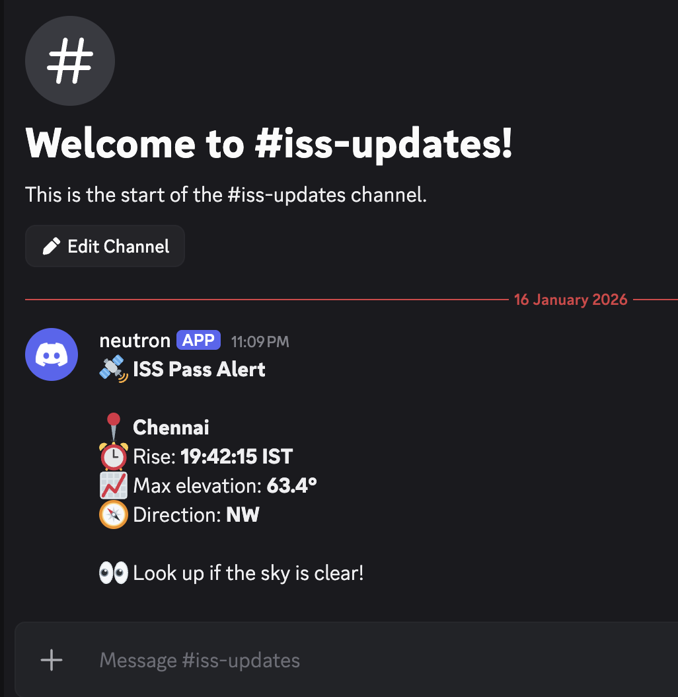

# 🛰️ Satellite Pass Alert System (ISS, Hubble, Tiangong)

A self‑hosted automation project that tracks **visible satellite passes** over a fixed location (Chennai, India) and sends **real‑time alerts to Discord**.

This project intentionally focuses on **correct system design** while working within the constraints of **n8n task runners**, rather than forcing long‑running Python processes into an automation platform.

---

## ✨ Features

- 🛰️ Tracks **ISS**, **Hubble Space Telescope**, and **Tiangong**
- 🌙 Filters passes to **night‑time visibility** using Sun elevation
- 📐 Calculates **maximum elevation angle** and viewing direction
- ⏰ Sends alerts **before the satellite rises**
- 🔁 Scheduled execution (no infinite loops)
- 🐳 Fully Dockerized **n8n + task runners**
- 🔔 Discord notifications
- 🧠 Designed around **stateless execution** principles

---

## 🧠 Architecture Overview

```
Schedule Trigger (n8n)
        ↓
Python Code Node (Skyfield calculations)
        ↓
If (any visible passes?)
        ↓
Loop Over Items
        ↓
Discord Notification
```

### Key Architectural Decisions

- **Scheduling handled by n8n**, not Python
- **Python code is stateless and short‑lived**
- No infinite loops or `sleep()`
- No filesystem access from Python
- Each run completes within seconds

This matches how **n8n runners are designed to work**.

---

## 📂 Repository Structure

```
.
├── n8n_setup_docker/
│   ├── docker-compose.yml
│   ├── Dockerfile.runners
│   └── n8n-task-runners.json
│
├── Sat_Tracker.json
└── README.md
```

### Folder Details

#### `n8n_setup_docker/`
Docker configuration for running:
- n8n
- External task runners
- Python execution environment
- Skyfield ephemeris caching

#### `Sat_Tracker.json`
An exported **n8n workflow template** containing:
- Schedule Trigger
- Python Code node
- Conditional logic
- Loop over items
- Discord notification node

---

## 🐳 Running n8n with Docker

### 1️⃣ Prerequisites

- Docker
- Docker Compose
- Discord server with a webhook URL

---

### 2️⃣ Start n8n

```bash
cd n8n_setup_docker
docker compose up -d
```

Access n8n UI at:

```
http://localhost:5678
```

---

### 3️⃣ Import the Workflow

1. Open the n8n UI
2. Click **Import Workflow**
3. Import `Sat_Tracker.json`
4. Update:
   - Discord credentials
   - Schedule Trigger interval (recommended: every 1 minute)

---

## 🐍 Python Logic (Inside n8n)

The Python Code node uses **Skyfield** to:

- Fetch live **TLE data** from Celestrak
- Compute upcoming satellite passes
- Filter passes based on:
  - Elevation threshold
  - Night‑time visibility
  - Early‑alert window

The node returns a **JSON array** like:

```json
[
  {
    "satellite": "ISS",
    "rise_time": "19:42:15",
    "max_elevation": 63.4,
    "direction": "NW"
  }
]
```

Each array item results in one Discord message.

---



## ⚠️ Important Learnings About n8n Runners

A large part of this project involved understanding **n8n runner constraints**:

### Observed limitations

- Python runners are:
  - Sandboxed
  - Stateless
  - Short‑lived
- No filesystem access (`open()` is blocked)
- No background loops
- Hard execution timeout (~60 seconds)
- Runners exit automatically when idle

### Key takeaway

> **n8n is an orchestrator, not a job runner.**  
> Python runners are workers, not daemons.

Once the architecture respected this model, the system became stable and predictable.

---

## ⏱️ Scheduling Strategy

- Schedule Trigger runs every **1 minute**
- Python checks for passes occurring in the next **10 minutes**
- This avoids:
  - Missed flybys
  - Long‑running tasks
  - Unpredictable execution

Duplicate notifications are currently **allowed by design** to keep the workflow simple.

---

## 🔔 Discord Alerts

Each alert includes:

- Satellite name
- Local rise time
- Maximum elevation
- Viewing direction

Example:

```
🛰️ ISS PASS ALERT

📍 Location: Chennai
⏰ Rise: 19:42 IST
📈 Max Elevation: 63.4°
🧭 Direction: NW

👀 Look up!
```

---

## 🚀 Possible Extensions

- Deduplication using n8n Data Store (if enabled)
- Cloud cover filtering (Open‑Meteo)
- Sky‑path plots sent as images
- Grafana logging of passes
- Additional satellites (Starlink, NOAA, weather sats)
- External FastAPI service for heavy processing

---

## 🧪 Why This Project Matters

This project demonstrates:

- Designing within platform constraints
- Stateless execution patterns
- Proper separation of orchestration and computation
- Real‑world integration of science + automation
- When *not* to fight the platform

---

## 📜 License

MIT License — free to use, modify, and build upon.

---

## 🙌 Acknowledgements

- **Skyfield** by Brandon Rhodes
- **Celestrak** for TLE data
- **n8n** for open‑source automation

---

Clear skies and happy automating 🛰️✨
